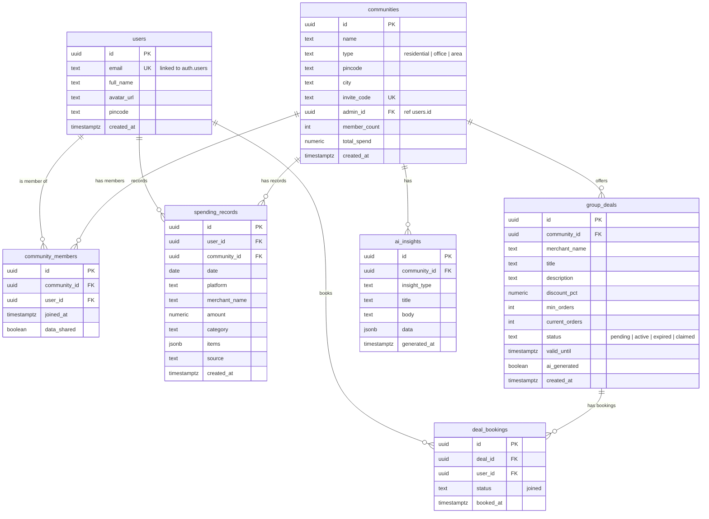

# Database Schema

This document details the current database schema for the Community Discounts project, based on the [schema.sql](file:///Users/ssrrattan/Documents/Community_Discounts/supabase/schema.sql) file.

## Entity Relationship Diagram

## Tables

### `users`
Extends Supabase `auth.users` with profile information.
| Column | Type | Constraints | Description |
| :--- | :--- | :--- | :--- |
| `id` | `UUID` | `PK`, `FK (auth.users)` | Links to Supabase Auth |
| `email` | `TEXT` | `UNIQUE`, `NOT NULL` | |
| `full_name` | `TEXT` | | |
| `avatar_url` | `TEXT` | | |
| `pincode` | `TEXT` | | |
| `created_at` | `TIMESTAMPTZ` | `DEFAULT NOW()` | |

### `communities`
Groups of users (societies, office parks, etc.).
| Column | Type | Constraints | Description |
| :--- | :--- | :--- | :--- |
| `id` | `UUID` | `PK`, `DEFAULT gen_random_uuid()` | |
| `name` | `TEXT` | `NOT NULL` | |
| `type` | `TEXT` | `NOT NULL`, `DEFAULT 'residential'` | |
| `pincode` | `TEXT` | | |
| `city` | `TEXT` | | |
| `invite_code` | `TEXT` | `UNIQUE`, `NOT NULL` | Short code for joining |
| `admin_id` | `UUID` | `FK (users.id)` | |
| `member_count` | `INTEGER` | `DEFAULT 0` | Auto-updated via trigger |
| `total_spend` | `NUMERIC` | `DEFAULT 0` | |
| `created_at` | `TIMESTAMPTZ` | `DEFAULT NOW()` | |

### `community_members`
Join table for users and communities.
| Column | Type | Constraints | Description |
| :--- | :--- | :--- | :--- |
| `id` | `UUID` | `PK` | |
| `community_id` | `UUID` | `FK (communities.id)`, `CASCADE` | |
| `user_id` | `UUID` | `FK (users.id)`, `CASCADE` | |
| `joined_at` | `TIMESTAMPTZ` | `DEFAULT NOW()` | |
| `data_shared` | `BOOLEAN` | `DEFAULT FALSE` | Has user shared data? |

### `spending_records`
Granular spending data for individual users.
| Column | Type | Constraints | Description |
| :--- | :--- | :--- | :--- |
| `id` | `UUID` | `PK` | |
| `user_id` | `UUID` | `FK (users.id)`, `CASCADE` | |
| `community_id` | `UUID` | `FK (communities.id)` | |
| `date` | `DATE` | `NOT NULL` | |
| `platform` | `TEXT` | `NOT NULL` | Swiggy, Zomato, etc. |
| `merchant_name` | `TEXT` | `NOT NULL` | |
| `amount` | `NUMERIC` | `NOT NULL` | |
| `category` | `TEXT` | `NOT NULL`, `DEFAULT 'food_delivery'` | |
| `items` | `JSONB` | | Detailed order items |
| `source` | `TEXT` | `DEFAULT 'csv_upload'` | |
| `created_at` | `TIMESTAMPTZ` | `DEFAULT NOW()` | |

### `group_deals`
Aggregated negotiation opportunities.
| Column | Type | Constraints | Description |
| :--- | :--- | :--- | :--- |
| `id` | `UUID` | `PK` | |
| `community_id` | `UUID` | `FK (communities.id)` | |
| `merchant_name` | `TEXT` | `NOT NULL` | |
| `title` | `TEXT` | `NOT NULL` | |
| `description` | `TEXT` | | |
| `discount_pct` | `NUMERIC` | `NOT NULL` | |
| `min_orders` | `INTEGER` | `NOT NULL` | Target to activate |
| `current_orders` | `INTEGER` | `DEFAULT 0` | Auto-updated via trigger |
| `status` | `TEXT` | `DEFAULT 'pending'` | pending \| active \| etc. |
| `valid_until` | `TIMESTAMPTZ` | | |
| `ai_generated` | `BOOLEAN` | `DEFAULT TRUE` | |
| `created_at` | `TIMESTAMPTZ` | `DEFAULT NOW()` | |

### `deal_bookings`
User commitment to specific deals.
| Column | Type | Constraints | Description |
| :--- | :--- | :--- | :--- |
| `id` | `UUID` | `PK` | |
| `deal_id` | `UUID` | `FK (group_deals.id)` | |
| `user_id` | `UUID` | `FK (users.id)` | |
| `status` | `TEXT` | `DEFAULT 'joined'` | |
| `booked_at` | `TIMESTAMPTZ` | `DEFAULT NOW()` | |

### `ai_insights`
Summaries and trends generated for communities.
| Column | Type | Constraints | Description |
| :--- | :--- | :--- | :--- |
| `id` | `UUID` | `PK` | |
| `community_id` | `UUID` | `FK (communities.id)` | |
| `insight_type` | `TEXT` | `NOT NULL` | |
| `title` | `TEXT` | `NOT NULL` | |
| `body` | `TEXT` | `NOT NULL` | |
| `data` | `JSONB` | | |
| `generated_at` | `TIMESTAMPTZ` | `DEFAULT NOW()` | |

## Automation (Triggers & Functions)

1.  **`handle_new_user()`**: Automatically copies new Auth users into the `public.users` table.
2.  **`update_member_count()`**: Syncs the `member_count` on the `communities` table whenever rows are added/removed from `community_members`.
3.  **`update_deal_orders()`**: Updates `current_orders` and sets status to `active` when a deal hits its `min_orders` threshold via `deal_bookings`.

## Security (RLS)

-   **`users`**: Users can only view/update their own profile.
-   **`communities`**: Members can only see metadata for communities they belong to.
-   **`spending_records`**: Users have exclusive access to their own data.
-   **`group_deals` & `ai_insights`**: Visibility is restricted to community members.
-   **`deal_bookings`**: Users manage only their own bookings.
